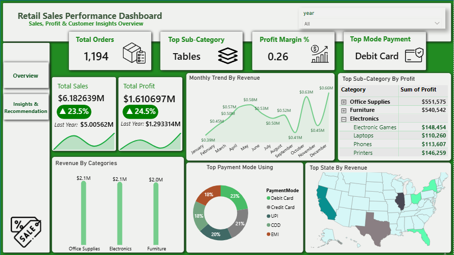
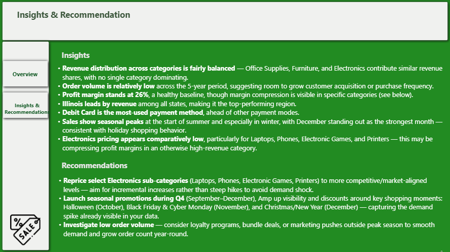
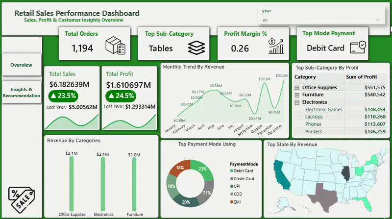

Retail Sales Performance Analysis (Python + Power BI)

Project Overview

This project presents a complete end-to-end data analytics workflow applied to a retail sales dataset.

It covers data cleaning and exploratory data analysis using Python, followed by the development of an interactive, KPI-driven dashboard in Power BI. The goal is to analyze sales performance, profitability, payment behavior, and seasonality trends to derive actionable business insights.

Tools & Technologies

Python (pandas, matplotlib, seaborn)
Jupyter Notebook (via VS Code)
Power BI Desktop (Interactive Dashboard, DAX Measures)
CSV — data storage & exchange format

Project Structure

sales_eda.ipynb — Python exploratory data analysis notebook
sales_cleaned.csv — cleaned dataset exported for Power BI
retail_sales_dashboard.pbix — Power BI dashboard
screenshots/ — dashboard screenshots & demos
README.md — project documentation

Data Source

The dataset is a retail sales transactional dataset containing order-level records, including order dates, product categories, payment modes, customer names, states, and profit figures.

Dataset Highlights

Total Transactions: 1,994 rows
Total Categories: 3 (Furniture, Electronics, Office Supplies)
Time Span: 5 years
Total Revenue: $6,182,639
Total Profit: $1,610,697
Overall Profit Margin: 26%

Data Cleaning Steps

Checked and handled null and duplicate values
Renamed the Amount column to revenue for clarity
Verified data types across numeric, categorical, and date columns
Extracted Year and Month columns from Order Date
Treated each row as an independent transaction (Order ID not used for aggregation)
Detected and reviewed negative profit entries
Identified and treated outliers using boxplots
Exported the cleaned dataset via to_csv() for Power BI import

Exploratory Data Analysis (EDA)

Analyzed categorical distributions across Category, Sub-Category, and Payment Mode
Investigated negative profit transactions
Built outlier detection boxplots for revenue and profit
Calculated profit margin at the transaction level
Generated a correlation heatmap across numeric variables
Conducted state-level revenue and profit analysis
Built a Category × Payment Mode crosstab
Aggregated data before plotting to avoid noisy, misleading row-level charts

Dashboard

Power BI Dashboard

Interactive dashboard with dynamic filtering and custom DAX measures.

Features:

KPI Cards: Total Orders, Top Sub-Category, Profit Margin %, Top Payment Mode
Total Sales & Total Profit cards with YoY growth indicators (colored trend badges)
Monthly Revenue Trend (line chart)
Revenue by Category (bar chart)
Top Payment Mode Distribution (donut chart)
Top State by Revenue (map)
Top Sub-Category by Profit (nested table)
Year slicer for dynamic time filtering
Overview & Insights/Recommendations navigation pages
---

## Dashboard Preview

### Power BI Dashboard

---
Key Insights

Revenue distribution across categories is fairly balanced, with no single category dominating
Order volume is relatively low across the 5-year period, indicating room to grow purchase frequency
Overall profit margin stands at a healthy 26%
Illinois leads all states by revenue
Debit Card is the most-used payment method
Sales show clear seasonal peaks at the start of summer and especially in December, consistent with holiday shopping behavior
Electronics sub-categories (Laptops, Phones, Electronic Games, Printers) show comparatively lower profit contribution relative to their sales volume, suggesting pricing/margin compression

Recommendations

Reprice select Electronics sub-categories (Laptops, Phones, Electronic Games, Printers) to more competitive, margin-healthy levels
Launch seasonal promotions during Q4 (September–December), aligned with Halloween, Black Friday, Cyber Monday, and the Christmas/New Year season, to capitalize on existing demand spikes
Investigate strategies to grow order volume year-round, such as loyalty programs or bundle deals, to reduce reliance on seasonal peaks

Notes

The dataset does not include a continuous date table by default; Year-over-Year measures were built using manual DAX as well as a separate Date dimension table using SAMEPERIODLASTYEAR.

Data Pipeline

Raw Sales CSV → Data Cleaning & EDA (Python) → Data Export to CSV → Dashboard Development in Power BI

Author

Hajar — Python | Power BI | Data Analytics
